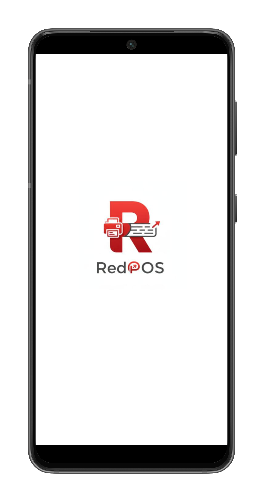
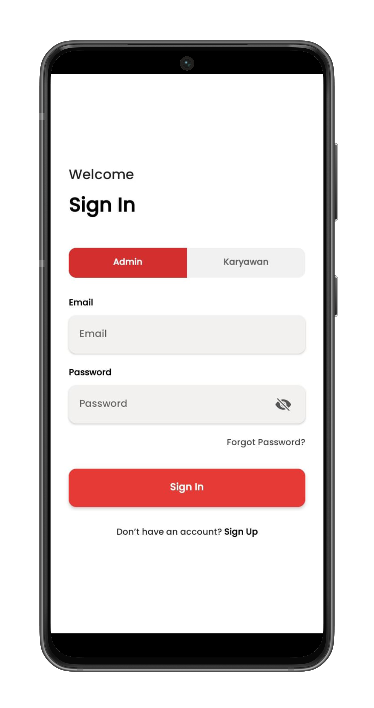
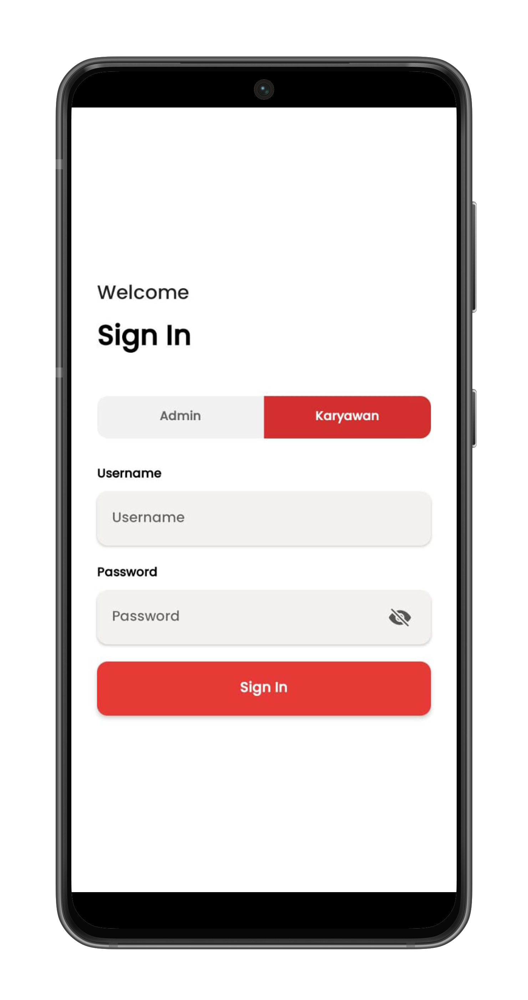
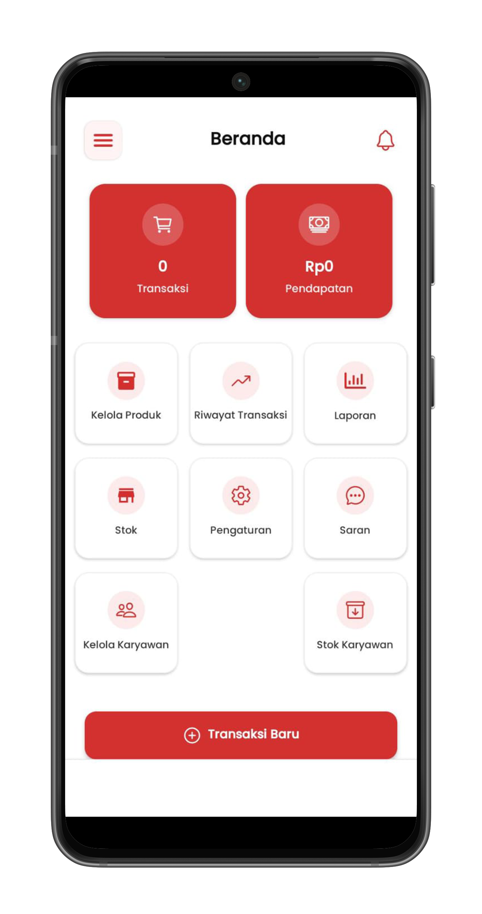
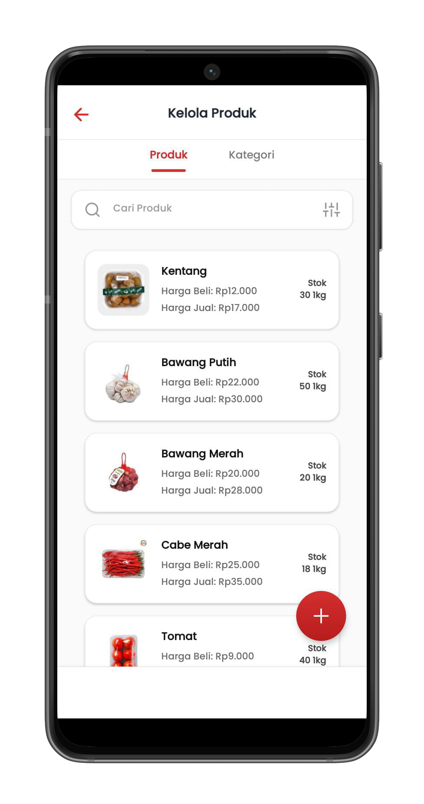
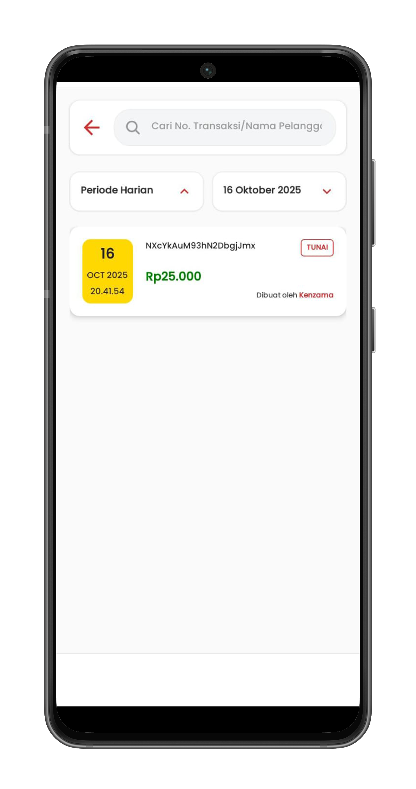
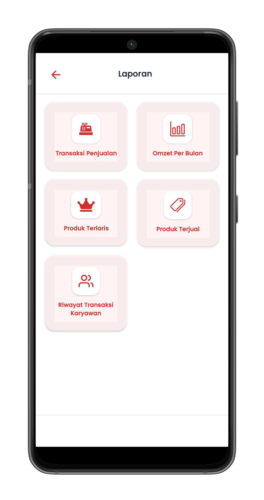
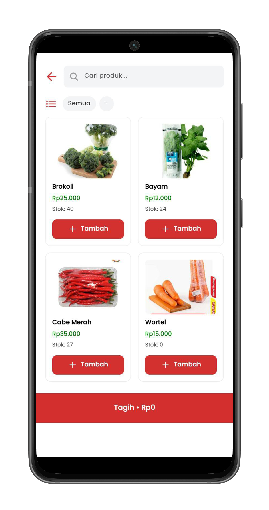

# Gotani POS

Aplikasi **Point of Sales (POS) berbasis mobile** yang dikembangkan menggunakan **React Native (Expo) dan Firebase**.
Aplikasi ini dirancang untuk membantu usaha kecil atau UMKM dalam mengelola transaksi penjualan secara digital, mencatat riwayat transaksi, serta memantau laporan penjualan secara praktis melalui perangkat mobile.

---

## Preview Aplikasi

<p align="center">
  
  
  
</p>

<p align="center">
  
  
  
</p>

<p align="center">
  
  
</p>

---

---

## Features

- Autentikasi pengguna (Login & Register)
- Dashboard penjualan
- Manajemen transaksi
- Riwayat transaksi
- Laporan penjualan
- Pengaturan akun pengguna

---

## Tech Stack

Frontend

- React Native
- Expo
- TypeScript

Backend

- Firebase Authentication
- Firebase Firestore

Tools

- Expo Router
- Node.js
- Git & GitHub

---

## Project Structure

```
gotani-pos
│
├── app
│   ├── (tabs)
│   │   ├── index.tsx
│   │   ├── transaksi.tsx
│   │   ├── laporan.tsx
│   │   └── pengaturan.tsx
│   │
│   └── auth
│       ├── login.tsx
│       └── register.tsx
│
├── components
│
├── services
│   └── firebase.ts
│
├── assets
│
├── screenshots
│
├── README.md
├── package.json
└── app.json
```

---

## Installation

Clone repository

```
git clone https://github.com/callmezaa/GOTANI-POS-APP.git
```

Masuk ke folder project

```
cd gotani-pos
```

Install dependencies

```
npm install
```

Jalankan aplikasi

```
npx expo start
```

Aplikasi dapat dijalankan menggunakan **Expo Go** atau emulator Android.

---

## Author

**Ken Zamariyan**
Informatics Engineering Student

---

## License

This project is licensed under the MIT License.
