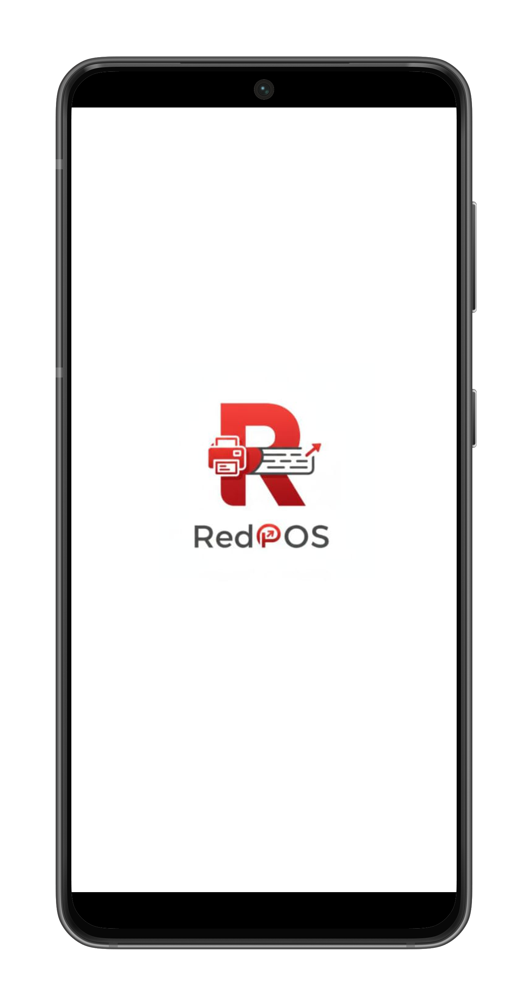
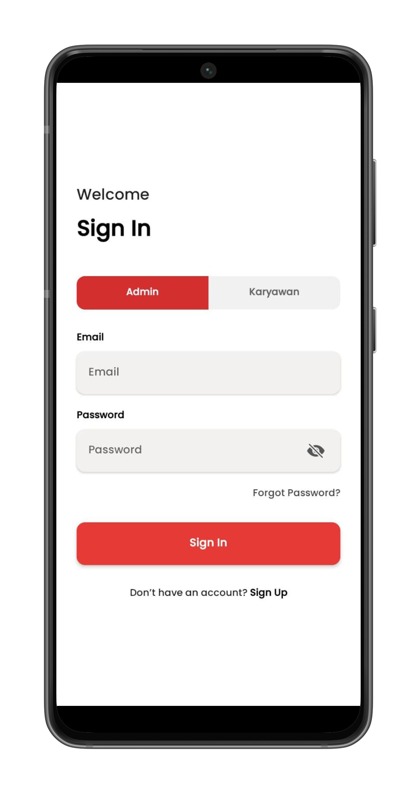
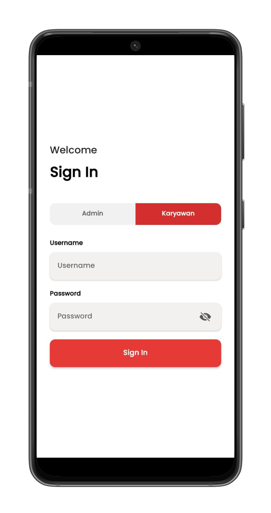
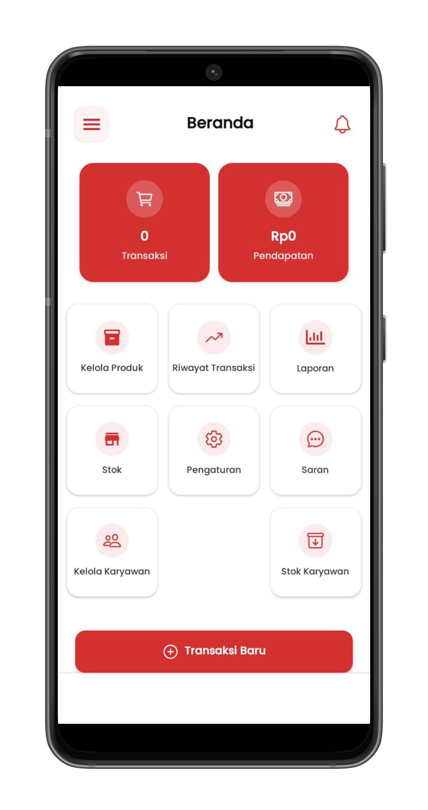
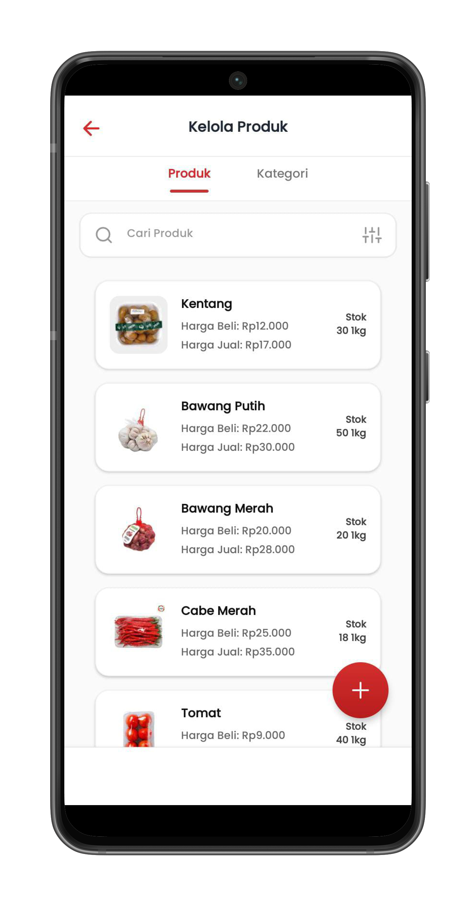
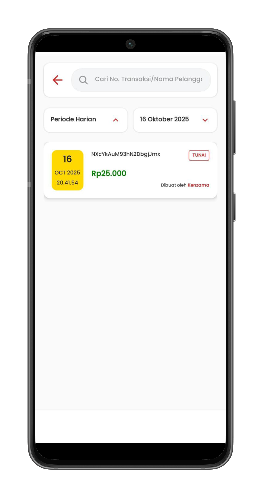
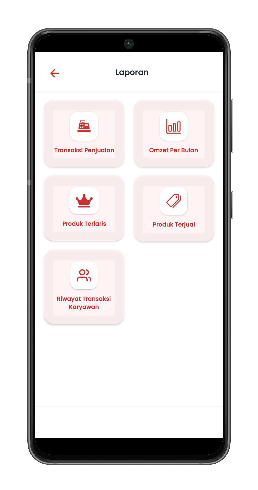
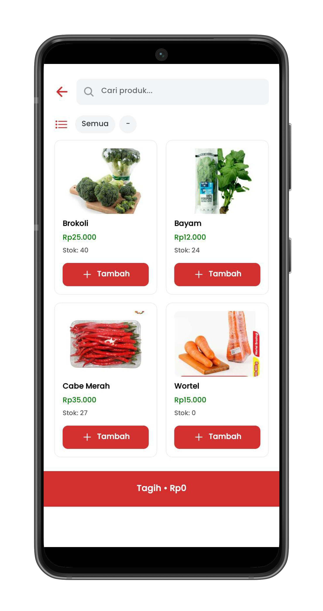

<div align="center">
  

  <h1 align="center" style="margin-top: 12px;">GOTANI POS</h1>

  <p align="center">
    Aplikasi <strong>Point of Sales (POS)</strong> berbasis mobile untuk UMKM
    <br />
    Dikembangkan dengan <strong>React Native (Expo)</strong> dan <strong>Firebase</strong>
  </p>

  <p align="center">
    <a href="#features">Fitur</a> •
    <a href="#tech-stack">Tech Stack</a> •
    <a href="#screenshots">Screenshot</a> •
    <a href="#architecture">Arsitektur</a> •
    <a href="#installation">Instalasi</a> •
    <a href="#author">Author</a>
  </p>

  <!-- Tech Badges -->
  <p align="center">
    
    
    
    
    
    
  </p>
</div>

---

## 📋 Daftar Isi

- [Fitur Unggulan](#fitur-unggulan)
- [Tech Stack](#tech-stack)
- [Screenshot Aplikasi](#screenshot-aplikasi)
- [Arsitektur Aplikasi](#arsitektur-aplikasi)
- [Struktur Proyek](#struktur-proyek)
- [Struktur Database Firestore](#struktur-database-firestore)
- [Instalasi & Menjalankan](#instalasi--menjalankan)
- [Environment Variables](#environment-variables)
- [Author](#author)
- [Lisensi](#lisensi)

---

## ✨ Fitur Unggulan

### 👥 Multi-Role Authentication
Sistem autentikasi dual-mode dengan **Admin** (Firebase Auth) dan **Karyawan** (login username/password). Admin memiliki akses penuh ke seluruh fitur, sementara akses karyawan dibatasi sesuai kebijakan toko.

### 💳 Transaksi & Pembayaran
Proses transaksi cepat dengan dukungan **pembayaran Tunai** (dengan perhitungan kembalian otomatis) dan **pembayaran Online** melalui integrasi **Midtrans** — termasuk QRIS, GoPay, OVO, ShopeePay, dan DANA.

### 📊 Laporan & Analitik
5 jenis laporan dengan visualisasi data interaktif:
- **Omzet per Bulan** — grafik garis + breakdown triwulan
- **Produk Terlaris** — diagram lingkaran top 5 produk
- **Produk Terjual** — daftar detail dengan filter periode
- **Transaksi Penjualan** — grafik batang, ekspor CSV & PDF
- **Riwayat Transaksi Karyawan** — filter per pegawai

### 📦 Manajemen Stok
Kelola stok produk secara lengkap dengan fitur:
- **Riwayat stok** (barang masuk/keluar)
- **Stok kadaluarsa** dengan tanggal kedaluwarsa
- **Distribusi stok ke karyawan**
- **Supplier management** dengan riwayat pengadaan

### 🧑‍💼 Manajemen Karyawan
Kelola data karyawan, pantau transaksi masing-masing, dan batasi akses berdasarkan peran (`kasir`, `inventaris`, `manajer`).

### 📄 Cetak & Kirim Struk
Generate struk digital yang bisa di-*share* dalam format teks ke berbagai aplikasi (WhatsApp, Email, dll.) melalui **Expo Sharing**.

---

## 🛠 Tech Stack

| **Kategori** | **Teknologi** | **Kegunaan** |
|:-------------|:--------------|:-------------|
| **Framework** | React Native 0.76 + Expo SDK 52 | Pengembangan aplikasi mobile cross-platform |
| **Bahasa** | TypeScript | Type safety & developer experience |
| **Navigation** | Expo Router v4 (file-based routing) | Navigasi dengan struktur folder |
| **Autentikasi** | Firebase Authentication | Login admin (email/password) |
| **Database** | Firebase Firestore | Database real-time NoSQL |
| **State Management** | React Context + mitt (Event Emitter) | Manajemen state global & event |
| **Payment Gateway** | Midtrans Snap (Midtrans Client) | Pembayaran online (QRIS, e-Wallet) |
| **Backend Server** | Express.js (Node.js) | Server webhook Midtrans |
| **UI Components** | Lottie, Reanimated, Gesture Handler, Linear Gradient | Animasi & interaksi yang halus |
| **Charts** | react-native-chart-kit, d3-scale, recharts | Visualisasi data laporan |
| **QR Code** | react-native-qrcode-svg | Generate QRIS payment |
| **Export** | expo-print, expo-sharing, react-native-blob-util | Cetak & export PDF/CSV |

---

## 📸 Screenshot Aplikasi

<div align="center">
  <table>
    <tr>
      <td align="center">
        <br />
        <em>Splash Screen</em>
      </td>
      <td align="center">
        <br />
        <em>Login Admin</em>
      </td>
      <td align="center">
        <br />
        <em>Login Karyawan</em>
      </td>
    </tr>
    <tr>
      <td align="center">
        <br />
        <em>Dashboard</em>
      </td>
      <td align="center">
        <br />
        <em>Kelola Produk</em>
      </td>
      <td align="center">
        <br />
        <em>Riwayat Transaksi</em>
      </td>
    </tr>
    <tr>
      <td align="center">
        <br />
        <em>Laporan Penjualan</em>
      </td>
      <td align="center">
        <br />
        <em>Transaksi Baru</em>
      </td>
      <td align="center"></td>
    </tr>
  </table>
</div>

---

## 🏗 Arsitektur Aplikasi

```
┌──────────────────────────────────────────────────────────────────┐
│                   GOTANI POS - Mobile App                        │
│            React Native (Expo SDK 52) + TypeScript               │
│                                                                  │
│  ┌──────────────────────────────────────────────────────────┐   │
│  │                    Screens (Expo Router)                  │   │
│  │  Auth │ Dashboard │ Transactions │ Stock │ Reports │ ... │   │
│  └───────────────────────┬──────────────────────────────────┘   │
│                          │                                      │
│  ┌───────────────────────▼──────────────────────────────────┐   │
│  │              Context / State Management                   │   │
│  │     UserContext (role, uid) │ EventEmitter (mitt)        │   │
│  └───────────────────────┬──────────────────────────────────┘   │
│                          │                                      │
│  ┌───────────────────────▼──────────────────────────────────┐   │
│  │                 Firebase SDK (Client)                     │   │
│  │  Authentication │ Firestore (Real-time)                  │   │
│  └───────────────────────┬──────────────────────────────────┘   │
└──────────────────────────┼───────────────────────────────────────┘
                           │
┌──────────────────────────▼───────────────────────────────────────┐
│                   Firebase Backend (BaaS)                        │
│  ┌─────────────┐  ┌─────────────────┐  ┌──────────────────┐    │
│  │ Firebase    │  │ Firestore DB    │  │ Firebase Storage │    │
│  │ Auth        │  │ (users, produk, │  │ (foto profil,    │    │
│  │ (Admin)     │  │  transaksi...)  │  │  gambar produk)  │    │
│  └─────────────┘  └─────────────────┘  └──────────────────┘    │
└──────────────────────────────────────────────────────────────────┘

┌──────────────────────────────────────────────────────────────────┐
│              Express Server (Node.js) - Midtrans                 │
│  /create-transaction → Snap Token │ /webhook → Payment Status   │
└──────────────────────────────────────────────────────────────────┘
```

**Alur Autentikasi:**
1. **Admin** → Firebase Auth (email/password) → Session di AsyncStorage
2. **Karyawan** → Cari di Firestore `users/{adminUid}/employees/{uid}` → Session di AsyncStorage

**Alur Transaksi:**
1. Pilih produk → Atur jumlah → Pilih metode bayar
2. **Tunai:** Masukkan nominal → Hitung kembalian → Simpan ke Firestore → Kurangi stok
3. **Online:** Generate token Midtrans → Redirect ke pembayaran → Webhook update status

---

## 📁 Struktur Proyek

```
gotani-pos/
│
├── app/                              # Screens & Routing (Expo Router)
│   ├── _layout.tsx                   # Root layout
│   ├── index.tsx                     # Entry redirect
│   ├── splash.tsx                    # Splash screen
│   │
│   ├── auth/                         # Authentication screens
│   │   ├── login.tsx
│   │   ├── register.tsx
│   │   └── forgot-password.tsx
│   │
│   └── (tabs)/                       # Main app screens
│       ├── _layout.tsx               # Tab navigator
│       ├── index.tsx                 # Dashboard
│       ├── add-transaction.tsx       # Transaksi baru
│       ├── add-product.tsx           # Manajemen produk
│       ├── transaction-history.tsx   # Riwayat transaksi
│       ├── employees.tsx             # Manajemen karyawan
│       ├── stock-management.tsx      # Manajemen stok
│       ├── reports.tsx               # Laporan
│       ├── settings.tsx              # Pengaturan
│       ├── feedback.tsx              # Saran & masukan
│       │
│       ├── payment/                  # Payment screens
│       │   ├── confirm.tsx
│       │   ├── cash.tsx
│       │   ├── online.tsx
│       │   └── success.tsx
│       │
│       ├── stock/                    # Stock management
│       │   ├── kelola.tsx
│       │   ├── detail-stok.tsx
│       │   ├── edit-stok.tsx
│       │   ├── supplier.tsx
│       │   └── pembagian.tsx
│       │
│       ├── laporan/                  # Reports
│       │   ├── transaksi-penjualan.tsx
│       │   ├── produk-terlaris.tsx
│       │   ├── produk-terjual.tsx
│       │   ├── omzet-per-bulan.tsx
│       │   └── riwayat-transaksi-karyawan.tsx
│       │
│       ├── karyawan/                 # Employee management
│       │   ├── add-employees.tsx
│       │   ├── edit-employees.tsx
│       │   └── profil.tsx
│       │
│       └── pengaturan/               # Settings pages
│           ├── profil.tsx
│           ├── struk.tsx
│           └── ubah-password.tsx
│
├── components/                       # Reusable components
│   ├── RoleGuard.tsx                 # Access control
│   ├── RoleBlockModal.tsx            # Denied access modal
│   ├── CalendarPicker.tsx
│   ├── MonthPicker.tsx
│   ├── TransactionCard.tsx
│   └── CustomDrawer.tsx
│
├── contexts/                         # React Context providers
│   ├── UserContext.tsx
│   └── EmployeeContext.tsx
│
├── lib/                              # Utilities & helpers
│   └── event.ts                      # Event emitter (mitt)
│
├── utils/                            # Utility functions
│   ├── qrisGenerator.ts
│   └── uploadImage.ts
│
├── styles/                           # Global styles
│   └── global.ts
│
├── assets/                           # Images, fonts, animations
│
├── firebaseConfig.ts                 # Firebase initialization
├── server.js                         # Express (Midtrans server)
├── .env.example                      # Environment template
└── package.json
```

---

## 🔥 Struktur Database Firestore

```
users/{uid}/
├── profile (name, role, photoURL, createdAt)
├── produk/{productId}
│   ├── nama, harga_jual, kategori, stok, gambar, isActive
│   └── stok_history/{stockId}
│       ├── jumlah, harga_modal, harga_jual, expired_date, supplierId
│       └── riwayat/{logId} (tambah/kurangi)
├── transaksi/{transactionId}
│   ├── items[], total, metode_bayar, createdAt
│   └── (struk config, dll)
├── employees/{employeeId}
│   ├── name, username, password, role, photoUrl
│   └── transaksi/{transactionId}
├── suppliers/{supplierId}
│   ├── nama, nomor_hp, alamat, catatan
│   └── riwayat/{logId}
└── kategori/{categoryId}
    └── nama

admins/index
└── uids[] (daftar UID admin)

struk/{adminUid}
└── nama_toko, alamat, logo, footer
```

---

## 🚀 Instalasi & Menjalankan

### Prerequisites

- Node.js **≥ 18.x**
- npm atau yarn
- **Expo CLI** (`npm install -g expo-cli`)
- Android Studio (untuk emulator Android) atau **Expo Go** (di perangkat fisik)
- Xcode (untuk iOS — hanya macOS)

### Langkah instalasi

**1. Clone repositori**

```bash
git clone https://github.com/callmezaa/GOTANI-POS-APP.git
cd GOTANI-POS-APP
```

**2. Install dependencies**

```bash
npm install
```

**3. Konfigurasi environment**

```bash
cp .env.example .env
```

Edit file `.env` dan isi dengan credentials yang sesuai.

**4. Firebase setup**

Buat project di [Firebase Console](https://console.firebase.google.com), aktifkan:
- **Authentication** (Email/Password)
- **Firestore Database** (mode production)

Kemudian update `firebaseConfig.ts` dengan konfigurasi project Anda.

**5. Jalankan aplikasi**

```bash
npx expo start
```

Scan QR code dengan **Expo Go** (Android/iOS), atau tekan `a` untuk emulator Android.

### Menjalankan Server Midtrans

```bash
node server.js
```

Server berjalan di `http://localhost:4000`.

---

## 🔐 Environment Variables

Buat file `.env` berdasarkan `.env.example`:

| Variable | Deskripsi |
|:---------|:----------|
| `MIDTRANS_CLIENT_KEY` | Client key dari dashboard Midtrans |
| `MIDTRANS_SERVER_KEY` | Server key dari dashboard Midtrans |
| `FIREBASE_API_KEY` | API Key dari Firebase project |
| `FIREBASE_PROJECT_ID` | Project ID dari Firebase |

---

## 👨‍💻 Author

<div align="center">
  <table>
    <tr>
      <td align="center">
        <strong>Ken Zamariyan</strong>
      </td>
    </tr>
    <tr>
      <td align="center">
        <em>Informatics Engineering Student</em>
      </td>
    </tr>
    <tr>
      <td align="center">
        <a href="https://github.com/callmezaa">
          
        </a>
        <a href="https://www.linkedin.com/in/ken-zamariyan/">
          
        </a>
      </td>
    </tr>
  </table>
</div>

---

## 📄 Lisensi

Distributed under the **MIT License**. See `LICENSE` for more information.

---

<div align="center">
  <sub>Built with ❤️ by <strong>Ken Zamariyan</strong> — Informatics Engineering</sub>
  <br />
  <sub>© 2024-2025 GOTANI POS. All rights reserved.</sub>
</div>
